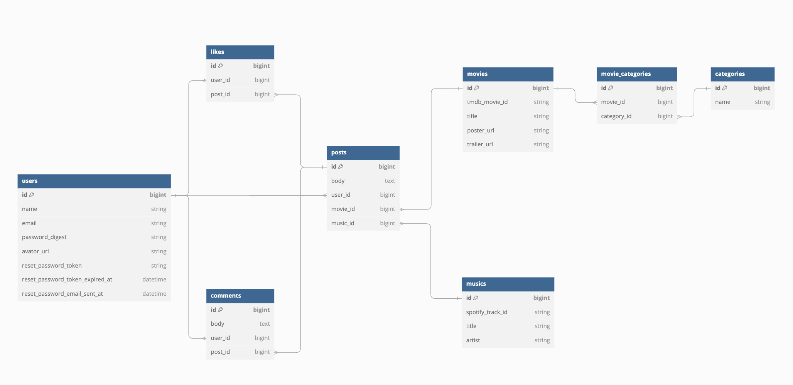

# サービス概要
お気に入りの映画の楽曲を共有するサービス

# このサービスへの思い・作りたい理由
映画が好きであること。好きである理由の1つが、映画を通して、様々な年代やジャンルの音楽と出会うことができるから。映画を見終わった後に、サウンドトラックを探し、何度もリピートした経験がある。しかし、時間が経つと、その楽曲を聞かなくなってしまう。ふと、「あの映画のあの曲何だったっけ？」と思うことがある。そこで、お気に入りの映画と音楽を紐づけて投稿・共有できたらよいと思い、作ろうと考えた。思い出を忘れないようにデータとして残したり、新しい音楽に出会ったりするだけではなく、「音楽が良いからこの映画を見てみよう」という映画との出会いという付加価値も提供できればよいと思う。

# ユーザ層について
映画というジャンルに絞っているため、以下のユーザ層を設定する
* 映画に興味がある人
* 音楽に興味がある人
* ある映画に思い入れがある人

# サービスの利用イメージ
* 利用シーン
  * 暇つぶし
  * 映画の思い出に浸りたい時
  * 映画が見たくなった時
* 利用イメージ
  * ユーザが映画と音楽を紐づけたデータを投稿する
  * 他のユーザはその投稿の閲覧やいいねができる
  * 投稿の詳細には映画の予告編などの動画情報が表示される
* 提供価値
  * 新しい音楽に出会える
  * 新しい映画に出会える
  * 思い出を懐かしむことができる

# ユーザの獲得について
SNSでの発信、ソーシャルポートフォリオへの投稿

# サービスの差別化ポイント・推しポイント
映画に関するサービスはレビューやスコア、検索に力を入れている。  
差別化ポイントは、本サービスが音楽に着目している点。  
本サービスには、あえてレビューやスコア機能は実装しない。  

# 技術選定
| カテゴリ  | 技術 |
| ------------- | ------------- |
| バックエンド  | Ruby, Ruby on Rails  |
| 環境構築  | Docker |
| API  | TMDb API, Spotify API, Youtube API |

# 機能候補・実装方針
* ユーザ登録、ログイン機能 → sorcery
* 多言語機能 → i18n
* いいね機能 → Ajax
* ページネーション → kaminari
* 検索機能(部分検索、オートコンプリート) → ransack
* レスポンシブデザイン → Bootstrap
* 映画データ → TMDb API
* 音楽データ → Spotify API
* 投稿閲覧機能 (未ログインでも利用可)
* 投稿作成機能
* 投稿編集機能
* 投稿削除機能
* コメント投稿機能
* マイページ機能
* お問い合わせフォーム
* 退会フォーム
* パスワード再設定機能

# 画面遷移図
* Figma URL  
https://www.figma.com/board/qLUzx7nb0syGcKitsrqJoX/%E7%94%BB%E9%9D%A2%E9%81%B7%E7%A7%BB%E5%9B%B3%E4%BD%9C%E6%88%90?node-id=0-1&t=otqxS2UlwA6kdbFc-1  　
* 画面遷移図(企画段階)

# ER図
* DB Diagram URL  
https://dbdiagram.io/d/RUNTEQ-67384e54e9daa85acaa647d9
* ER図

